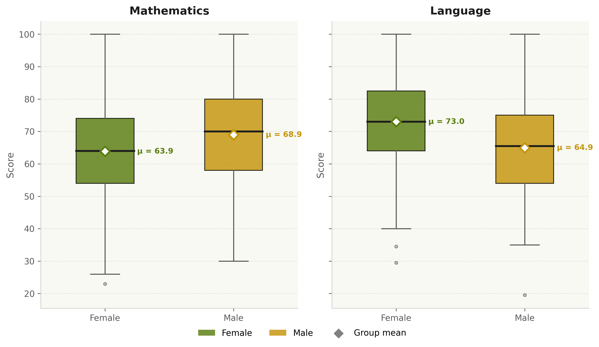
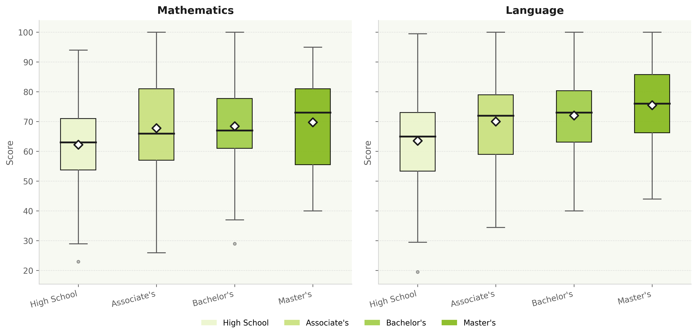
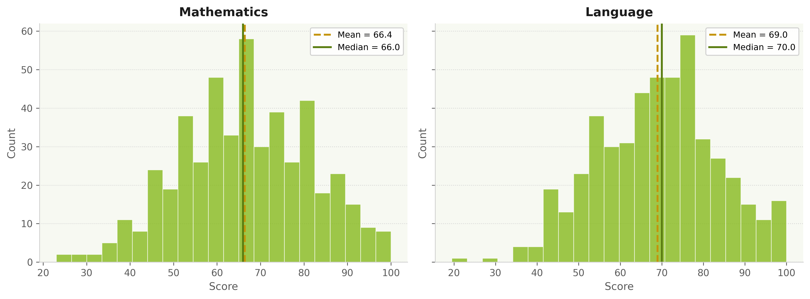
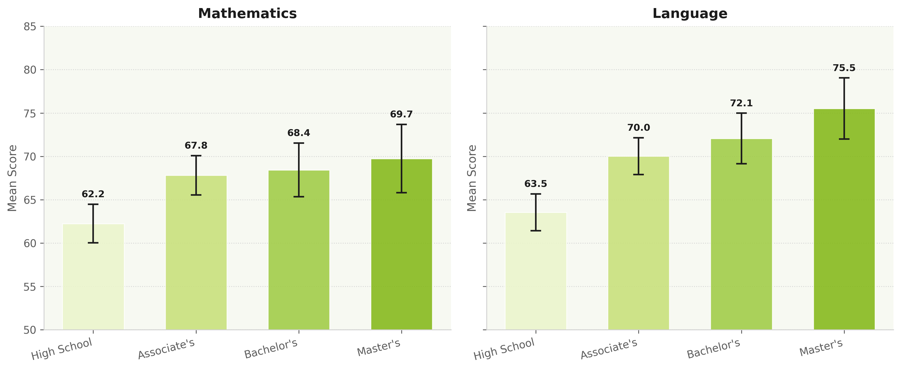
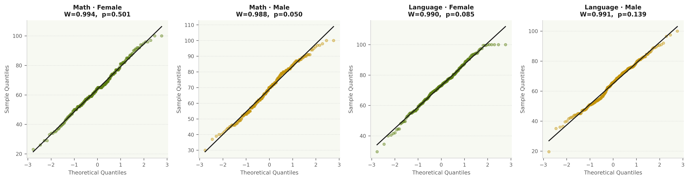

# Student Scores Analysis
**TU Dortmund University — M.Sc. Data Science Application Report WS 2026/27**

Statistical analysis of Mathematics and Language test scores for 486 students, examining the association of gender and parental education level with academic performance.

---

## Research Questions

- **RQ1:** Is there a statistically significant difference between male and female students in their Mathematics and Language scores?
- **RQ2:** Is there a statistically significant difference in scores across parental education levels? If so, which groups differ?

---

## Key Findings

| | Mathematics | Language |
|---|---|---|
| **Gender** | Males score higher (+5.1 pts, p < 0.001) | Females score higher (+8.1 pts, p < 0.001) |
| **Effect size** | Hedges' g = −0.34 (small-to-moderate) | Hedges' g = +0.58 (moderate) |
| **Education** | High school < all college groups | High school < all college groups; Master's > Associate's |
| **Effect size** | η² = 0.037 (small) | η² = 0.081 (small-to-moderate) |

---

## Figures

### Gender × Subject


### Parental Education × Subject


### Score Distributions by Subject


### Mean Scores ± 95% CI by Parental Education


### Normality Check — Q–Q Plots


---

## Repository Structure

```
student-scores-analysis/
├── data/
│   └── Scores.csv               # raw dataset (972 rows × 5 columns)
├── notebooks/
│   └── analysis.ipynb           # full analysis: EDA → tests → effect sizes
├── figures/
│   ├── fig1_histograms.pdf/.png
│   ├── fig2_gender_boxplots.pdf/.png
│   ├── fig3_edu_boxplots.pdf/.png
│   ├── fig4_means_ci.pdf/.png
│   └── fig5_qq_plots.pdf/.png
├── report/
│   ├── report_final.pdf         # submitted report
├── requirements.txt
└── README.md
```

---

## Methods

| Step | Method |
|---|---|
| Gender comparison | Welch two-sample t-test |
| Education comparison | One-way ANOVA |
| Post-hoc | Tukey HSD |
| Robustness check | Kruskal-Wallis |
| Effect sizes | Hedges' g, η² |
| Assumption checks | Shapiro-Wilk, Levene's test |

---

## Setup

```bash
pip install -r requirements.txt
jupyter notebook notebooks/analysis.ipynb
```

Place `Scores.csv` in `data/` before running.

---

## Dataset

Provided by the Department of Statistics, TU Dortmund University, for the M.Sc. Data Science application WS 2026/27.

- 486 students, 2 subjects (Mathematics, Language)
- Variables: gender, parental level of education (ordinal, 4 levels), test score (0–100)
- No missing values

---

*Submitted by Maheen Eatazaz — M.Sc. Data Science Application, TU Dortmund University*
